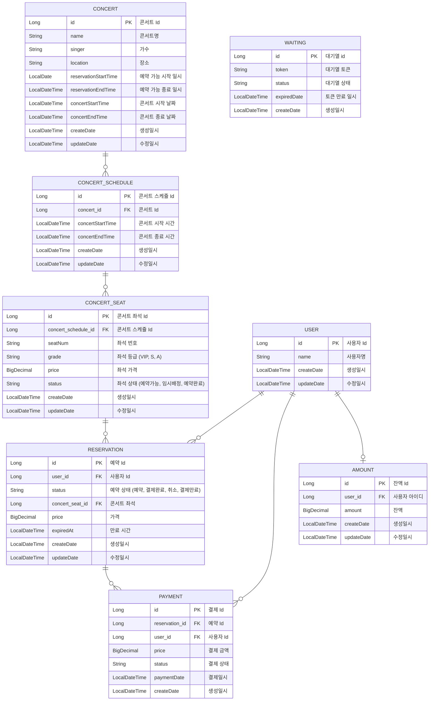

```mermaid
erDiagram
    CONCERT ||--o{ CONCERT_SCHEDULE: ""
    CONCERT_SCHEDULE ||--o{ CONCERT_SEAT: ""
    CONCERT_SEAT ||--o{ RESERVATION: ""
    USER ||--o{ RESERVATION: ""
    USER ||--o{ PAYMENT: ""
    USER ||--o| AMOUNT: ""
    RESERVATION ||--o{ PAYMENT: ""

    CONCERT {
        Long id PK "콘서트 Id"
        String name "콘서트명"
        String singer "가수"
        String location "장소"
        LocalDate reservationStartTime "예약 가능 시작 일시"
        LocalDateTime reservationEndTime "예약 가능 종료 일시"
        LocalDateTime concertStartTime "콘서트 시작 날짜"
        LocalDateTime concertEndTime "콘서트 종료 날짜"
        LocalDateTime createDate "생성일시"
        LocalDateTime updateDate "수정일시"
    }

    CONCERT_SCHEDULE {
        Long id PK "콘서트 스케쥴 Id"
        Long concert_id FK "콘서트 Id"
        LocalDateTime concertStartTime "콘서트 시작 시간"
        LocalDateTime concertEndTime "콘서트 종료 시간"
        LocalDateTime createDate "생성일시"
        LocalDateTime updateDate "수정일시"
    }

    CONCERT_SEAT {
        Long id PK "콘서트 좌석 Id"
        Long concert_schedule_id FK "콘서트 스케쥴 Id"
        String seatNum "좌석 번호"
        String grade "좌석 등급 (VIP, S, A)"
        BigDecimal price "좌석 가격"
        String status "좌석 상태 (예약가능, 임시배정, 예약완료)"
        LocalDateTime createDate "생성일시"
        LocalDateTime updateDate "수정일시"
    }

    AMOUNT {
        Long id PK "잔액 Id"
        Long user_id FK "사용자 아이디"
        BigDecimal amount "잔액"
        LocalDateTime createDate "생성일시"
        LocalDateTime updateDate "수정일시"
    }

    PAYMENT {
        Long id PK "결제 Id"
        Long reservation_id FK "예약 Id"
        Long user_id FK "사용자 Id"
        BigDecimal price "결제 금액"
        String status "결제 상태"
        LocalDateTime paymentDate "결제일시"
        LocalDateTime createDate "생성일시"
    }

    RESERVATION {
        Long id PK "예약 Id"
        Long user_id FK "사용자 Id"
        String status "예약 상태 (예약, 결제완료, 취소, 결제만료)"
        Long concert_seat_id FK "콘서트 좌석"
        BigDecimal price "가격"
        LocalDateTime expiredAt "만료 시간"
        LocalDateTime createDate "생성일시"
        LocalDateTime updateDate "수정일시"
    }

    USER {
        Long id PK "사용자 Id"
        String name "사용자명"
        LocalDateTime createDate "생성일시"
        LocalDateTime updateDate "수정일시"
    }

    WAITING {
        Long id PK "대기열 id"
        String token "대기열 토큰"
        String status "대기열 상태"
        LocalDateTime expiredDate "토큰 만료 일시"
        LocalDateTime createDate "생성일시"
    }

```