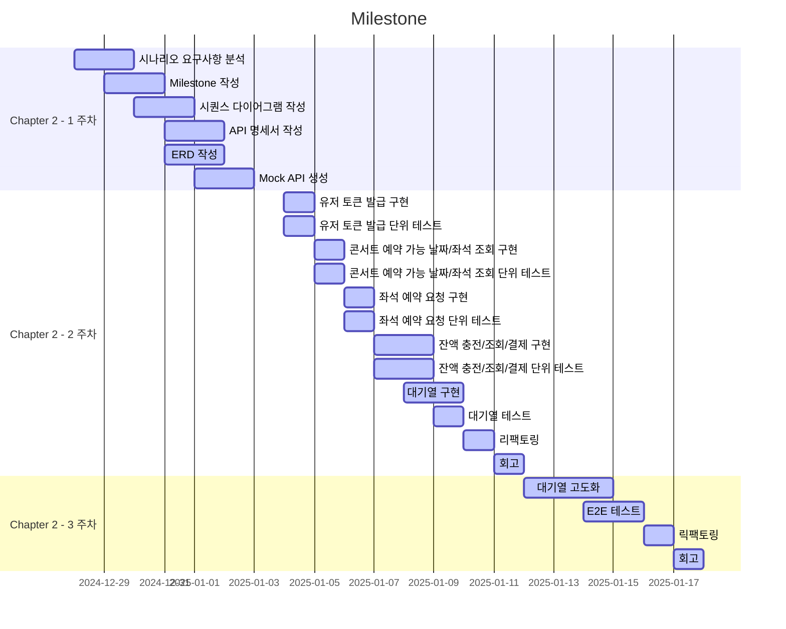

```mermaid

gantt
    title Milestone
    dateFormat  YYYY-MM-DD
    
    section Chapter 2 - 1 주차
    시나리오 요구사항 분석           :active, 2024-12-28, 2d
    Milestone 작성                  :active, 2024-12-29, 2d
    시퀀스 다이어그램 작성           :active, 2024-12-30, 2d
    API 명세서 작성                 :active, 2024-12-31, 2d
    ERD 작성                       :active, 2024-12-31, 2d
    Mock API 생성                  :active, 2025-01-01, 2d
    
    section Chapter 2 - 2 주차
    유저 토큰 발급 구현             :active, 2025-01-04, 1d
    유저 토큰 발급 단위 테스트       :active, 2025-01-04, 1d
    콘서트 예약 가능 날짜/좌석 조회 구현 :active, 2025-01-05, 1d
    콘서트 예약 가능 날짜/좌석 조회 단위 테스트 :active, 2025-01-05, 1d
    좌석 예약 요청 구현             :active, 2025-01-06, 1d
    좌석 예약 요청 단위 테스트       :active, 2025-01-06, 1d
    잔액 충전/조회/결제 구현        :active, 2025-01-07, 2d
    잔액 충전/조회/결제 단위 테스트  :active, 2025-01-07, 2d
    대기열 구현                    :active, 2025-01-08, 2d
    대기열 테스트                  :active, 2025-01-09, 1d
    리팩토링                      :active, 2025-01-10, 1d
    회고                          :active, 2025-01-11, 1d
    
    section Chapter 2 - 3 주차
    대기열 고도화                  :active, 2025-01-12, 3d
    E2E 테스트                    :active, 2025-01-14, 2d
    릭팩토링                      :active, 2025-01-16, 1d
    회고                          :active, 2025-01-17, 1d

```