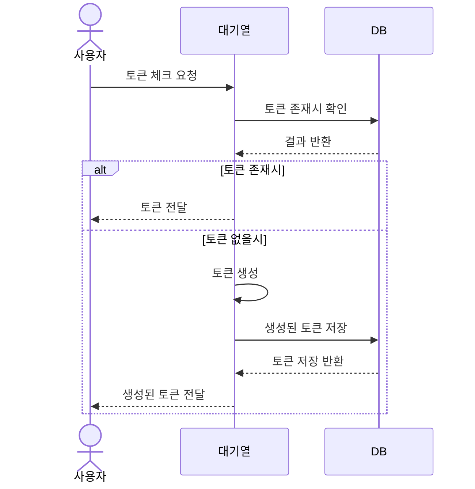
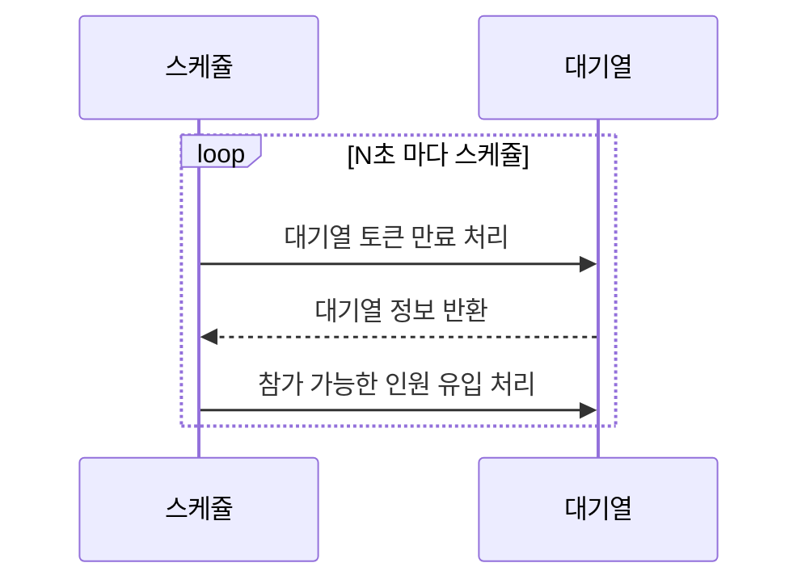
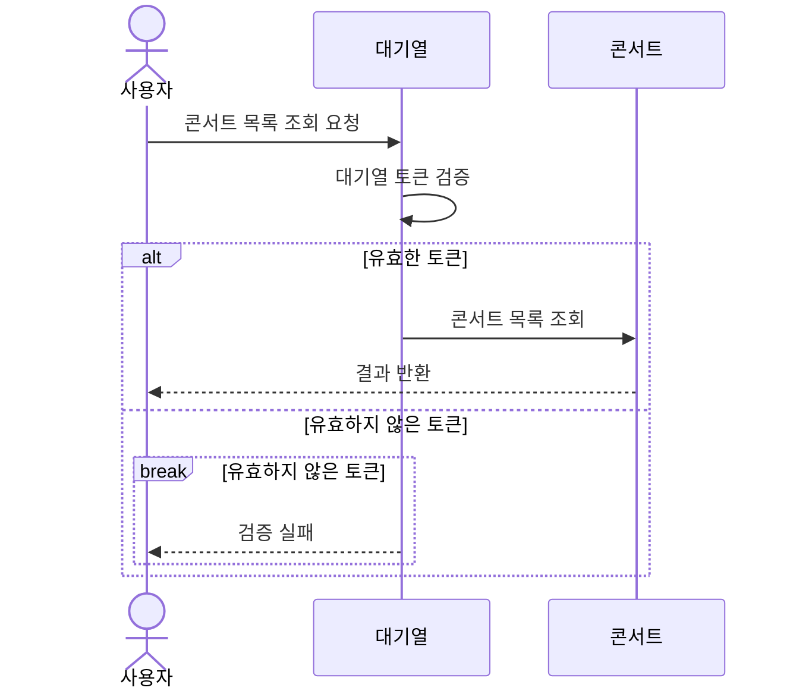
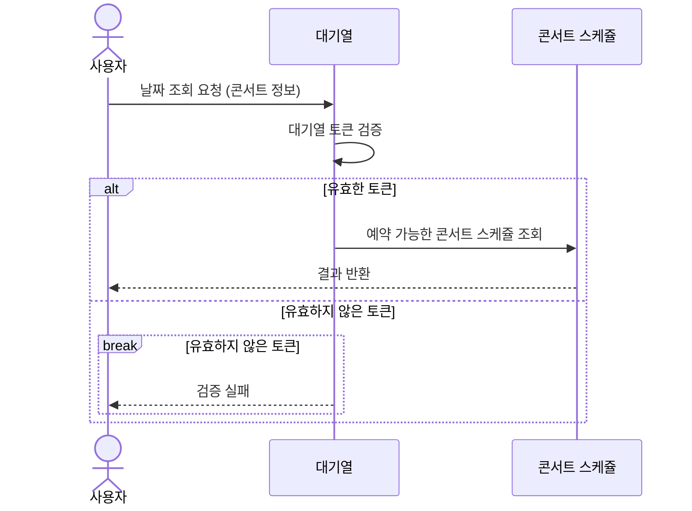
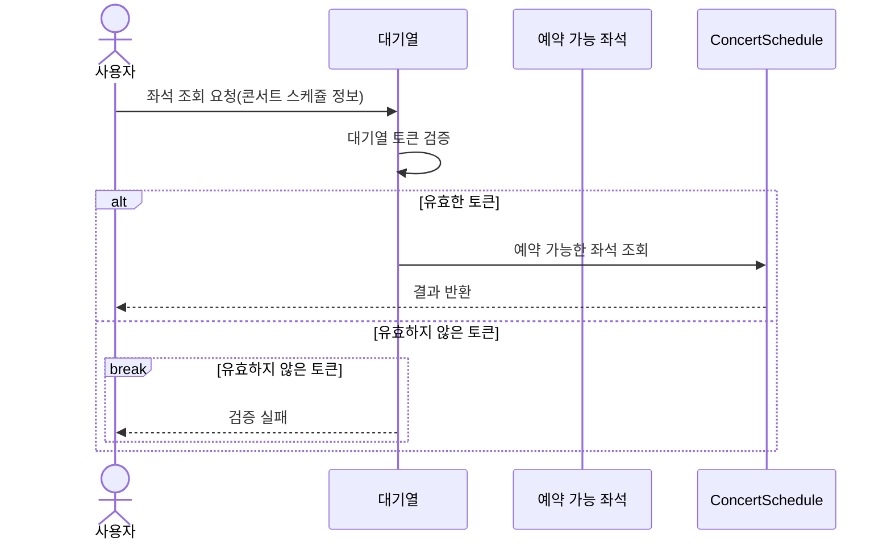
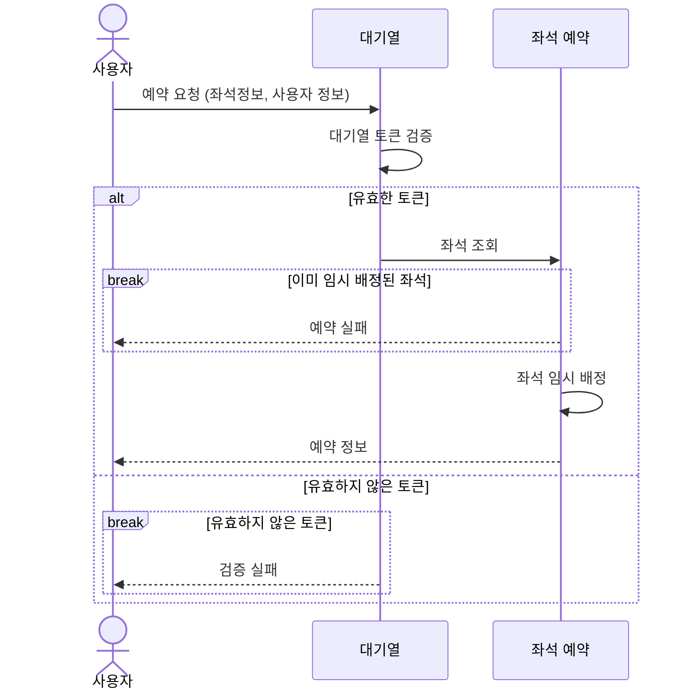
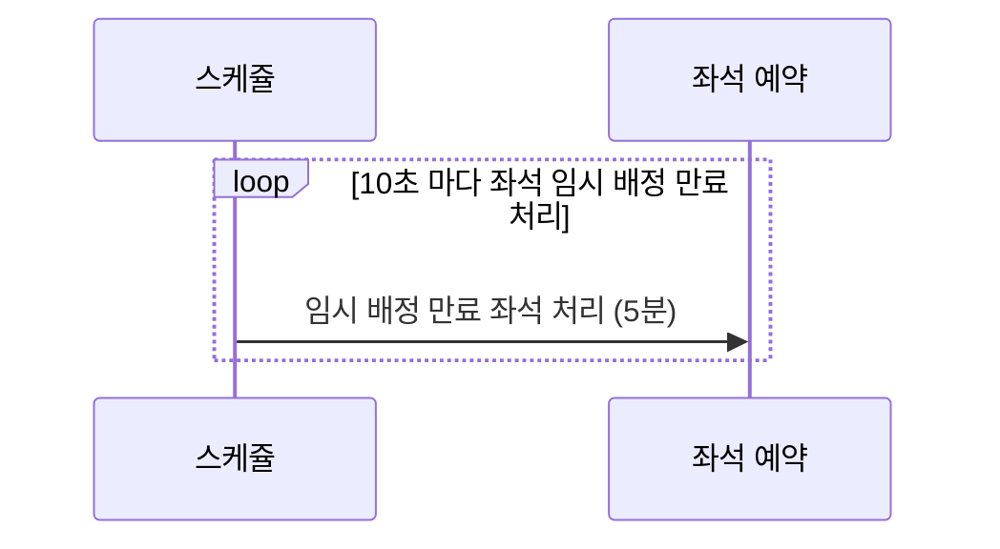
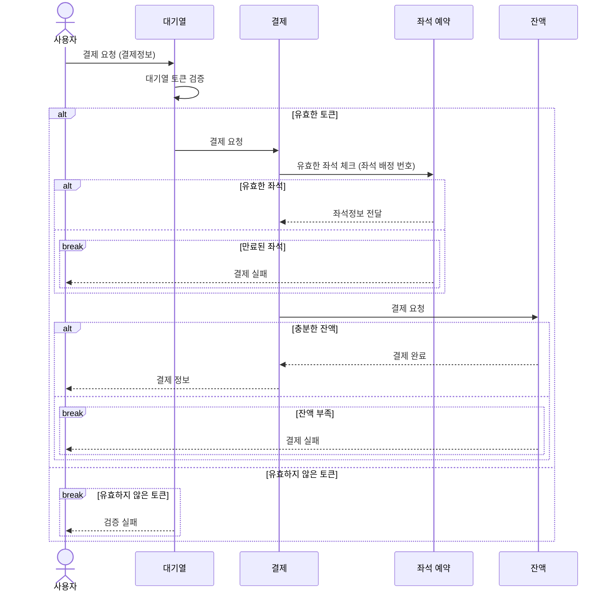
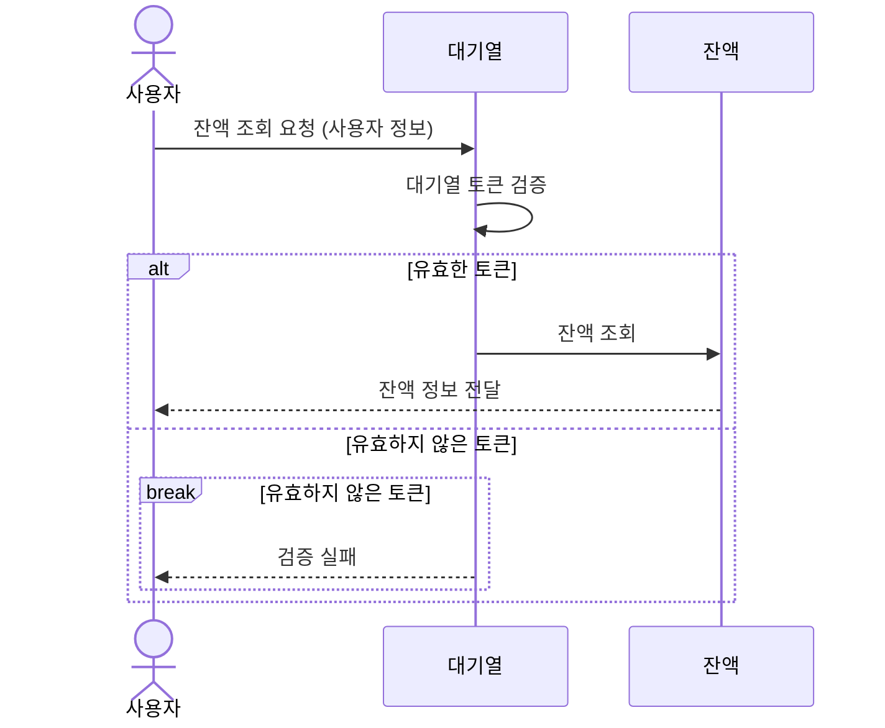
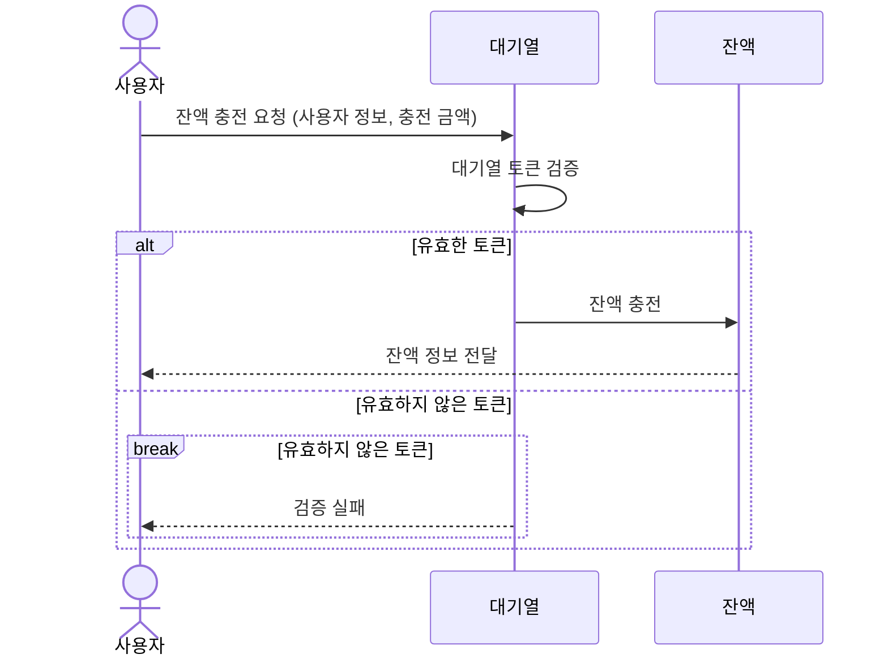

# 시퀀스 다이어그램

---

## 대기열 체크 API

```mermaid
sequenceDiagram
    actor User as 사용자
    participant Waiting as 대기열
    participant Database as DB

    User ->> Waiting: 토큰 체크 요청
    Waiting ->> Database: 토큰 존재시 확인
    Database -->> Waiting: 결과 반환

    alt 토큰 존재시
        Waiting -->> User: 토큰 전달
    else 토큰 없을시
        Waiting ->> Waiting: 토큰 생성
        Waiting ->> Database: 생성된 토큰 저장
        Database -->> Waiting: 토큰 저장 반환
        Waiting -->> User: 생성된 토큰 전달
    end
```

## 대기열 토큰 만료/진입 스케쥴러

```mermaid
sequenceDiagram
    participant Schedule as 스케쥴
    participant Waiting as 대기열
    
    loop N초 마다 스케쥴
        Schedule ->> Waiting: 대기열 토큰 만료 처리
        Waiting -->> Schedule: 대기열 정보 반환
        Schedule ->> Waiting: 참가 가능한 인원 유입 처리
    end
```

## 콘서트 조회 API

```mermaid
sequenceDiagram
    actor User as 사용자
    participant Waiting as 대기열
    participant Concert as 콘서트
    
    User ->> Waiting: 콘서트 목록 조회 요청
    Waiting ->> Waiting: 대기열 토큰 검증
    
    alt 유효한 토큰
        Waiting ->> Concert: 콘서트 목록 조회
        Concert -->> User: 결과 반환
    else 유효하지 않은 토큰
        break 유효하지 않은 토큰
            Waiting -->> User: 검증 실패
        end
    end
```

## 콘서트 날짜 조회 API

```mermaid
sequenceDiagram
    actor User as 사용자
    participant Waiting as 대기열
    participant ConcertSchedule as 콘서트 스케쥴
    
    User ->> Waiting: 날짜 조회 요청 (콘서트 정보)
    Waiting ->> Waiting: 대기열 토큰 검증
    
    alt 유효한 토큰
        Waiting ->> ConcertSchedule: 예약 가능한 콘서트 스케쥴 조회
        ConcertSchedule -->> User: 결과 반환
    else 유효하지 않은 토큰
        break 유효하지 않은 토큰
            Waiting -->> User: 검증 실패
        end
    end
    
```

## 좌석 조회 API

```mermaid
sequenceDiagram
    actor User as 사용자
    participant Waiting as 대기열
    participant Seat as 예약 가능 좌석
    
    User ->> Waiting: 좌석 조회 요청(콘서트 스케쥴 정보)
    Waiting ->> Waiting: 대기열 토큰 검증
    
    alt 유효한 토큰
        Waiting ->> ConcertSchedule: 예약 가능한 좌석 조회
        ConcertSchedule -->> User: 결과 반환
    else 유효하지 않은 토큰
        break 유효하지 않은 토큰
            Waiting -->> User: 검증 실패
        end
    end
    
```

## 좌석 예약 API

```mermaid
sequenceDiagram
    actor User as 사용자
    participant Waiting as 대기열
    participant seatReservation as 좌석 예약
    
    User ->> Waiting: 예약 요청 (좌석정보, 사용자 정보)
    Waiting ->> Waiting: 대기열 토큰 검증
    
    alt 유효한 토큰
        Waiting ->> seatReservation: 좌석 조회
        break 이미 임시 배정된 좌석
            seatReservation -->> User: 예약 실패
        end
        seatReservation ->> seatReservation: 좌석 임시 배정
        seatReservation -->> User: 예약 정보
    else 유효하지 않은 토큰
        break 유효하지 않은 토큰
            Waiting -->> User: 검증 실패
        end
    end
    
```
## 임시 배정 좌석 만료 스케쥴러

```mermaid
sequenceDiagram
    participant Schedule as 스케쥴
    participant seatReservation as 좌석 예약
    
    loop 10초 마다 좌석 임시 배정 만료 처리
        Schedule ->> seatReservation: 임시 배정 만료 좌석 처리 (5분)
    end
```

## 결제 API

```mermaid
sequenceDiagram
    actor User as 사용자
    participant Waiting as 대기열
    participant Payment as 결제
    participant SeatReservation as 좌석 예약
    participant Amount as 잔액
    
    User ->> Waiting: 결제 요청 (결제정보)
    Waiting ->> Waiting: 대기열 토큰 검증
    
    alt 유효한 토큰
        Waiting ->> Payment: 결제 요청
        Payment ->> SeatReservation: 유효한 좌석 체크 (좌석 배정 번호)
        
        alt 유효한 좌석
            SeatReservation -->> Payment: 좌석정보 전달

        else 
            break 만료된 좌석
                SeatReservation -->> User: 결제 실패
            end
        end
        
        Payment ->> Amount: 결제 요청
        alt 충분한 잔액
            Amount -->> Payment: 결제 완료
            Payment -->> User: 결제 정보
        else
            break 잔액 부족
                Amount -->> User: 결제 실패
            end
        end
        
            
    else 유효하지 않은 토큰
        break 유효하지 않은 토큰
            Waiting -->> User: 검증 실패
        end
    end
    
```

## 잔액 조회

```mermaid
sequenceDiagram
    actor User as 사용자
    participant Waiting as 대기열
    participant Amount as 잔액
    
    User ->> Waiting: 잔액 조회 요청 (사용자 정보)
    Waiting ->> Waiting: 대기열 토큰 검증
    alt 유효한 토큰
        Waiting ->> Amount: 잔액 조회
        Amount -->> User: 잔액 정보 전달
    else 유효하지 않은 토큰
        break 유효하지 않은 토큰
            Waiting -->> User: 검증 실패
        end
    end
    
```

## 잔액 충전

```mermaid
sequenceDiagram
    actor User as 사용자
    participant Waiting as 대기열
    participant Amount as 잔액
    
    User ->> Waiting: 잔액 충전 요청 (사용자 정보, 충전 금액)
    Waiting ->> Waiting: 대기열 토큰 검증

    alt 유효한 토큰
        Waiting ->> Amount: 잔액 충전
        Amount -->> User: 잔액 정보 전달
    else 유효하지 않은 토큰
        break 유효하지 않은 토큰
            Waiting -->> User: 검증 실패
        end
    end
```